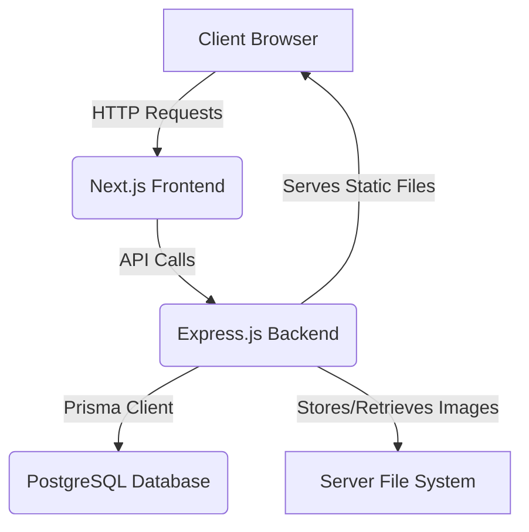
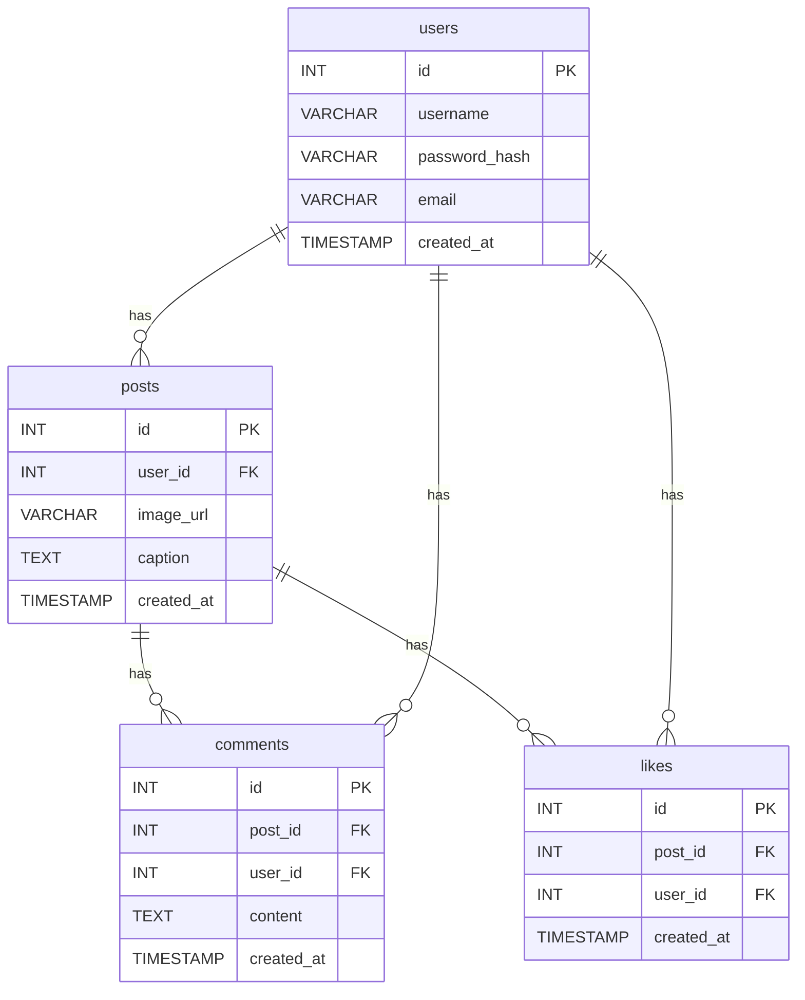

### Project Plan: Minimal Instagram Clone (Revised)

This document outlines the plan for building a minimal Instagram clone with a focus on core features like authentication, image posting, liking, and commenting.

#### 1. Core Technologies

*   **Frontend:**
    *   **Framework:** Next.js (React)
    *   **Styling:** Tailwind CSS v4
    *   **State Management:** React Context API
*   **Backend:**
    *   **Framework:** Node.js with Express.js
    *   **Database:** PostgreSQL
    *   **ORM:** **Prisma**
    *   **API Documentation:** Swagger (OpenAPI 3.1) with `swagger-ui-express` and `swagger-jsdoc`.
    *   **Authentication:** JWT (JSON Web Tokens) using the `jsonwebtoken` library.
    *   **Image Handling:** `multer` for handling file uploads.
*   **Diagrams:**
    *   All diagrams will be created using Mermaid.js.

#### 2. System Diagram

This diagram illustrates the high-level architecture of the application.

#### 3. Entity-Relationship (ER) Diagram

This diagram details the database schema. The `schema.prisma` file will be the definitive source of truth for the database structure.

#### 4. Development Plan

1.  **Backend Setup:**
    *   Initialize a Node.js project.
    *   Install Express.js, Prisma, and other dependencies.
    *   Initialize Prisma and define the database models in the `schema.prisma` file.
    *   Use Prisma Migrate to create the database schema in PostgreSQL.
    *   Create API endpoints for:
        *   User authentication (**register**, login).
        *   Posts (create, read, list).
        *   Comments (create, read).
        *   Likes (create, delete).
    *   Integrate Swagger for API documentation.
    *   Implement unit tests for the API endpoints using a framework like Jest.

2.  **Frontend Setup:**
    *   Initialize a Next.js project.
    *   Configure Tailwind CSS v4.
    *   Set up React Context for state management (authentication, user data).
    *   Create pages for:
        *   Login/**Register**.
        *   Home feed (displaying posts).
        *   Post creation (image upload).
        *   Post detail (showing comments and likes).
    *   Implement API calls to the backend.
