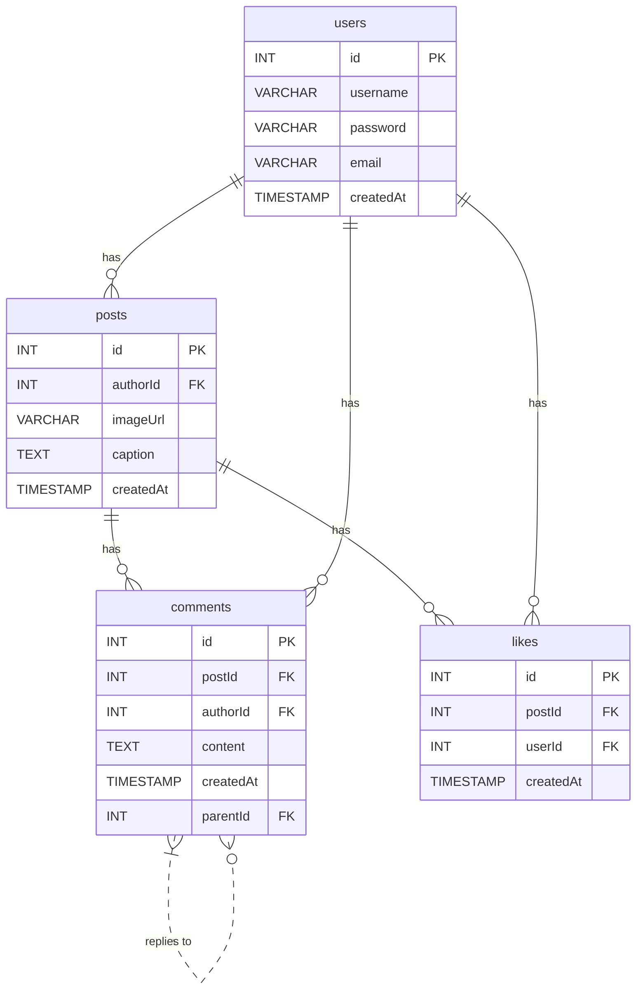

```mermaid
erDiagram
    users {
        INT id PK
        VARCHAR username
        VARCHAR password
        VARCHAR email
        TIMESTAMP createdAt
    }

    posts {
        INT id PK
        INT authorId FK
        VARCHAR imageUrl
        TEXT caption
        TIMESTAMP createdAt
    }

    comments {
        INT id PK
        INT postId FK
        INT authorId FK
        TEXT content
        TIMESTAMP createdAt
        INT parentId FK
    }

    likes {
        INT id PK
        INT postId FK
        INT userId FK
        TIMESTAMP createdAt
    }

    users ||--o{ posts : "has"
    posts ||--o{ comments : "has"
    posts ||--o{ likes : "has"
    users ||--o{ comments : "has"
    users ||--o{ likes : "has"
    comments }|..o{ comments : "replies to"
```