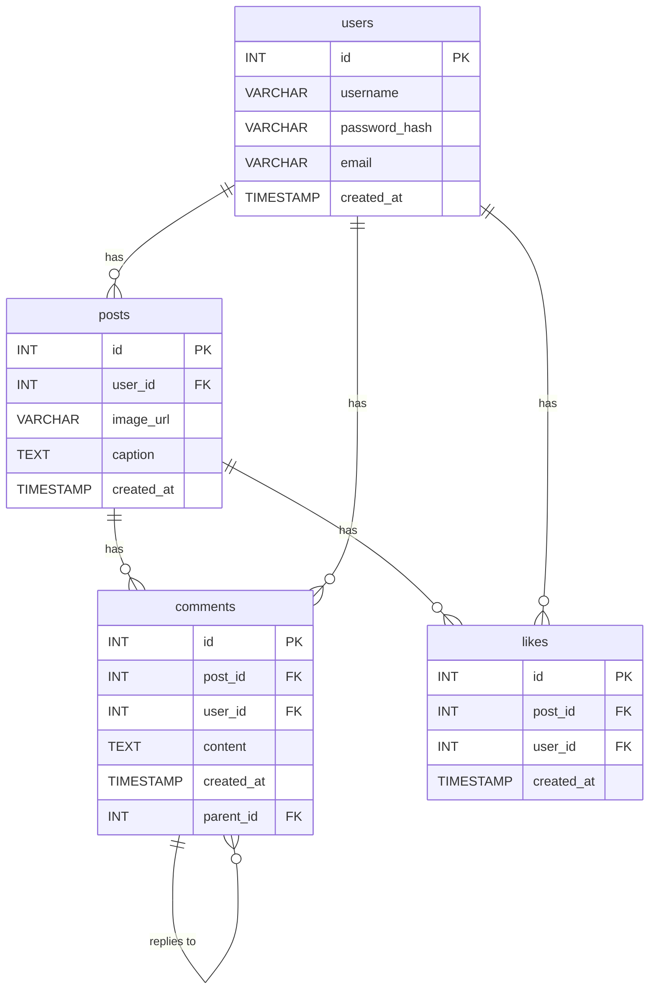

```mermaid
erDiagram
    users {
        INT id PK
        VARCHAR username
        VARCHAR password_hash
        VARCHAR email
        TIMESTAMP created_at
    }

    posts {
        INT id PK
        INT user_id FK
        VARCHAR image_url
        TEXT caption
        TIMESTAMP created_at
    }

    comments {
        INT id PK
        INT post_id FK
        INT user_id FK
        TEXT content
        TIMESTAMP created_at
        INT parent_id FK
    }

    likes {
        INT id PK
        INT post_id FK
        INT user_id FK
        TIMESTAMP created_at
    }

    users ||--o{ posts : "has"
    posts ||--o{ comments : "has"
    posts ||--o{ likes : "has"
    users ||--o{ comments : "has"
    users ||--o{ likes : "has"
    comments ||--o{ comments : "replies to" 
```