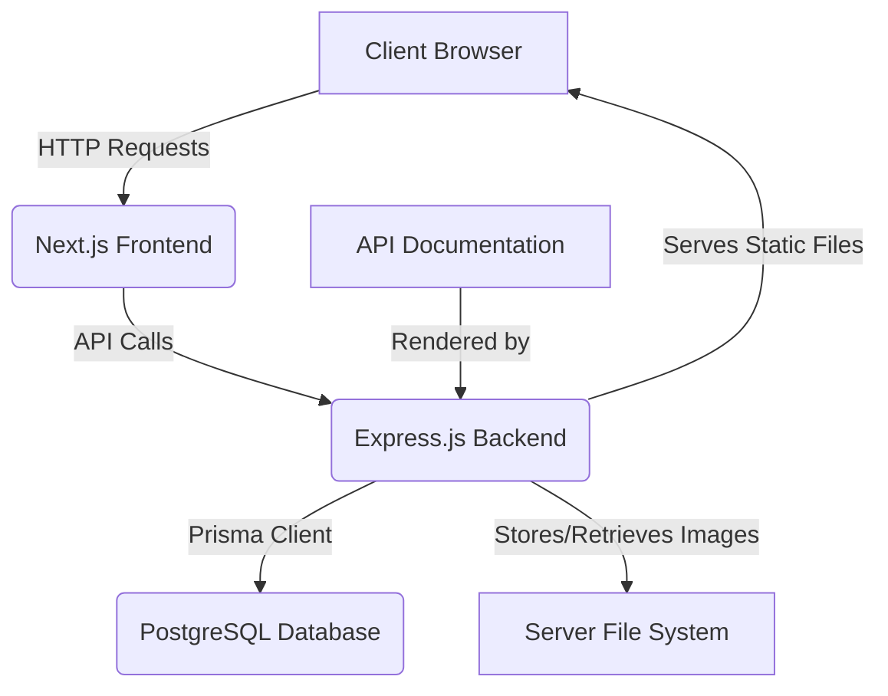

```mermaid
graph TD
    A[Client Browser] -->|HTTP Requests| B(Next.js Frontend);
    B -->|API Calls| C(Express.js Backend);
    C -->|Prisma Client| D(PostgreSQL Database);
    C -->|Serves Static Files| A;
    C -->|Stores/Retrieves Images| E[Server File System];
    F[API Documentation] -->|Rendered by| C;
```